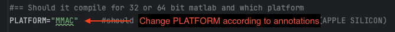
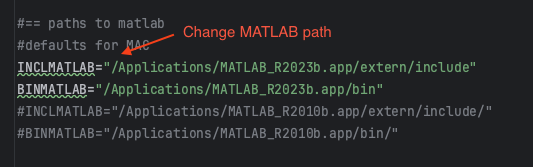

# NLX2MAC
A lot of neuroscientists use APPLE environment rather than Windows for their researches, 
however, there are no adequate tools to analyze electrophysiological data. Thus, we modified some of the
features are officially providing from the _Neuralynx_ to run in APPLE SILICON architectures. These features
are all rights reserved to the _Neuralynx_ and the Dr. Ueli Rutishauser's Lab.

# Installation
1. Download **ALL FILES** in the current repository into your own folders.
2. Open the **compile.sh** in the **source** folder.
3. Change some variables to adequate for your working environment.
   - Change the **PLATFORM** name to your architecture name.
   
   

   - Change the **MATLAB PATH**.

   

4. Run **compile.sh** in your MATLAB or Terminal (Recommend run in terminal).
5. Add **PATH** of the binaries folder (Location of mex functions) into your MATLAB settings.
6. Check the functions are working.

# Usage
- Follow example *.m files in this repository OR the original Nlx-MATLAB utility functions that are providing 
from the _Neuralynx_.

# Contact
Please contact through e-mail (minseok.kim#brain.snu.ac.kr) for more information or issues.

**Error** can be reported through [Git Issue](https://github.com/minsmis/NLX2MAC/issues).